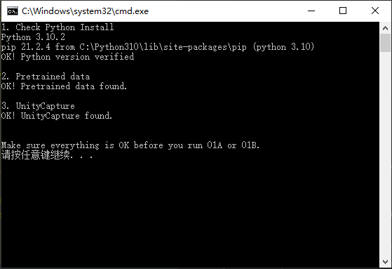
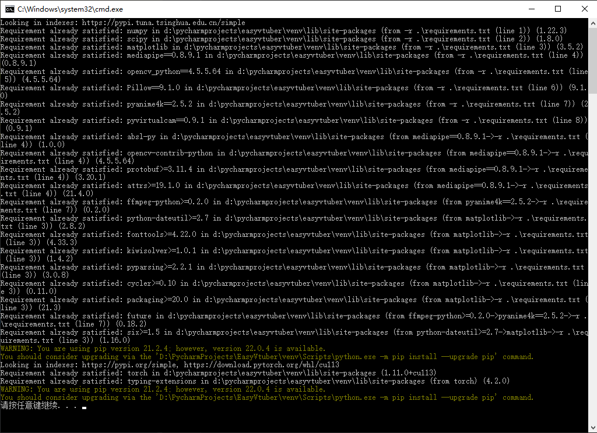
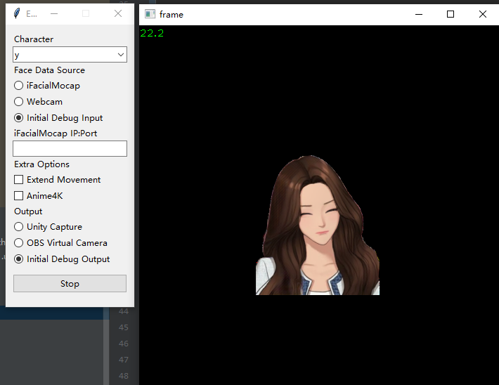

# EasyVtuber  

> 用买皮的钱，再买一张3080吧！


Fork自 https://github.com/GunwooHan/EasyVtuber  
为解决面捕质量问题，又反向port了原版demo https://github.com/pkhungurn/talking-head-anime-2-demo 中关于ifacialmocap的ios面捕逻辑  
并且省略了ifacialmocap pc端，通过UDP直连的方式使ios面捕刷新率达到30fps，解决了面捕刷新率的瓶颈  
最后，将EasyVtuber中使用的OBS虚拟摄像头方案切换为Unity Capture，解锁RGBA输出能力，无需绿背即可直接使用

[视频介绍和安装说明](https://www.bilibili.com/video/BV1uu411r7DR)  

## Requirements  

### 硬件  

- 支持FaceID的iPhone（使用ifacialmocap软件，需购买，需要稳定的WIFI连接）或网络摄像头（使用OpenCV）  
- 支持PyTorch CUDA的NVIDIA显卡（参考：TUF RTX3080 默频 26FPS 90%占用）
### 软件

- 本方案在Windows 10上测试可用
- Python>=3.8
- OBS或Unity Capture（虚拟摄像头方案）
- Photoshop或其他图片处理软件
- 科学上网方案，看懂英文网站和报错的能力

## Installation(Venv version)  
对于只是需要体验这个库的用户，推荐使用这个方式安装。  

### 下载ZIP并解压或者克隆本Repo  
点击[`Download ZIP`](../../archive/master.zip) 下载并解压，或者使用git克隆该仓库到你找得到的地方。  
完整展开venv需要大约5.5G的硬盘空间。  

### 检查并补齐必需文件
运行`00.检查并补齐必需文件.bat`  
  
按照提示操作，完成后再运行这个脚本进行检查，完全安装完成后的输出如图所示。

### 构建运行环境
运行适合你的地域的`01A.构建运行环境（默认源）.bat`或者`01B.构建运行环境（国内源）.bat`  
这个脚本会创建venv并使用pip安装所有需要的依赖  
两个脚本可以互相替代，并且支持从中断的位置继续  
如果出现网络相关报错，直接关掉控制台，调整网络，重新运行即可  
  
完全安装完成后再次运行脚本的输出如图所示。一般来说安装全程没有红字就是成功结束。

### 使用启动器测试结果
运行`02B启动器（调试输出）.bat`  
直接点击界面底部的`Save & Launch`
如果看到了弹出的opencv输出窗体，则安装成功完成



## Installation(Conda version)  

### 克隆本Repo  

克隆完以后如果直接用Pycharm打开了，先不要进行Python解释器配置。

### Python和Anaconda环境  

这个项目使用Anaconda进行包管理  
首先前往https://www.anaconda.com/ 安装Anaconda  
启动Anaconda Prompt控制台  
国内用户建议此时切换到清华源（pip和conda都要换掉，尤其是conda的Pytorch Channel，pytorch本体太大了）  
然后运行 `conda env create -f env_conda.yaml` 一键安装所有依赖  
如果有报错（一般是网络问题），删掉配了一半的环境，`conda clean --all`清掉下载缓存，调整配置后再试

安装完成后，在Pycharm内打开本项目，右下角解释器菜单点开，`Add Interpreter...`->`Conda Environment`->`Existing environment`  
选好自己电脑上的`conda.exe`和刚才创建好的`talking-head-anime-2-demo`环境内的`python.exe`    
点击OK，依赖全亮即可  

### 下载预训练模型  

https://github.com/pkhungurn/talking-head-anime-2-demo#download-the-model  
从原repo中下载（this Dropbox link）的压缩文件  
解压到`pretrained`文件夹中，与`PUT_MODEL_HERE`同级  
正确的目录层级为  
```
+ pretrained
  - combiner.pt
  - eyebrow_decomposer.pt
  - eyebrow_morphing_combiner.pt
  - face_morpher.pt
  - two_algo_face_rotator.pt
  - PUT_MODEL_HERE
```

### 输入输出设备  

#### OBS Virtual Camera

目前更推荐这个方案，UnityCapture存在未查明的性能瓶颈  
如果你选择自己进行抠像你可以直接输出到obs，如果你需要RGBA支持则需要额外使用一个Shader  
下载并安装StreamFX https://github.com/Xaymar/obs-StreamFX  
下载Shader（感谢树根的协助） https://github.com/shugen002/shader/blob/master/merge%20alpha2.hlsl  
之后，使用`--alpha_split`参数运行
  
你会看到这样的输出画面，透明通道单独使用灰度方式发送了  
之后对OBS中的视频采集设备添加滤镜-着色器-选择你下载的`merge alpha2.hlsl`-关闭   
这样透明通道就应用回左边的图像了  
你可能需要手动调整一下裁剪把右侧的无用画面切掉  
(看不到着色器滤镜的话就是StreamFX没装好或者OBS不是最新版)

#### UnityCapture  

如果需要使用透明通道输出，参考 https://github.com/schellingb/UnityCapture#installation 安装好UnityCapture  
只需要正常走完Install.bat，在OBS里能看到对应的设备（Unity Video Capture）就行  

在OBS添加完摄像头以后，还需要手动配置一次摄像头属性才能支持ARGB    
右键属性-取消激活-分辨率类型自定义-分辨率512x512(与`--output_size`参数一致)-视频格式ARGB-激活

#### iFacialMocap  

https://www.ifacialmocap.com/download/  
你大概率需要购买正式版（非广告，只是试用版不太够时长）  
购买之前确认好自己的设备支持  
**不需要下载PC软件**，装好iOS端的软件即可，连接信息通过参数传入Python  

## Run

完全体运行命令`python main.py --output_webcam unitycapture --ifm 192.168.31.182:49983 --character test1L2 --extend_movement 1 --output_size 512x512`

参数名 | 值类型 | 说明
:---: | :---: | :---:
--character|字符串|`character`目录下的输入图像文件名，不需要带扩展名
--debug|无|打开OpenCV预览窗口输出渲染结果，如果没有任何输出配置，该参数默认生效
--input|字符串|不使用iOS面捕时，传入要使用的摄像头设备名称，默认为设备0，有ifm参数时无效
--ifm|字符串|使用iOS面捕时，传入设备的`IP:端口号`，如`192.168.31.182:49983`
--output_webcam|字符串|可用值为`obs` `unitycapture`，选择对应的输出种类，不传不输出到摄像头
--extend_movement|浮点数|使用iOS面捕返回的头部位置，对模型输出图像进一步进行移动和旋转使得上半身可动<br>传入的数值表示移动倍率（建议值为1）
--output_size|字符串|格式为`256x256`，必须是4的倍数。<br>增大它并不会让图像更清晰，但配合extend_movement会增大可动范围
